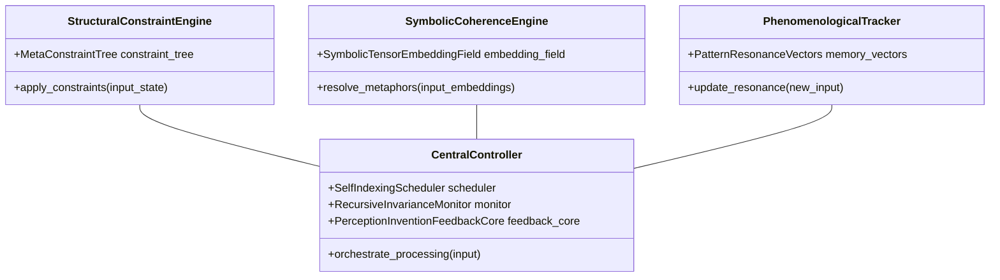
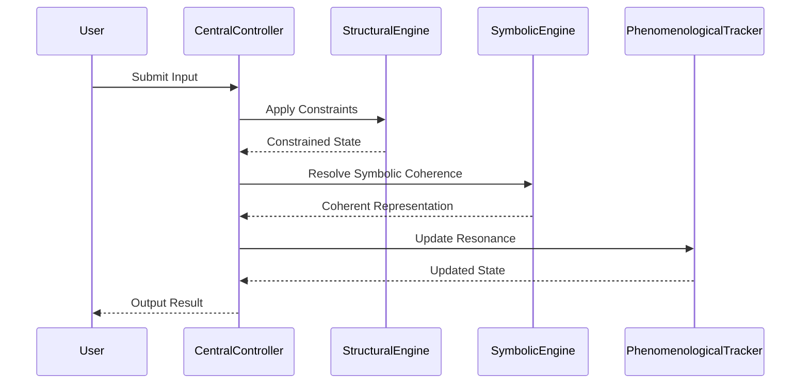

# Varkiel Agent Architecture  
[](LICENSE.txt)
[](./coverage)
[](https://github.com/ochoaughini/VarkielAgent/actions)
[](https://github.com/ochoaughini/VarkielAgent)

> **Lexsight LLC Proprietary Software** – 2025 Lexsight LLC.  
> Redistribution or derivative use outside the scope of the Lexsight LLC Proprietary Software License Agreement is strictly prohibited.

---

## Overview  
Varkiel constitutes a **tripartite cognitive agent architecture** engineered to deliver rigorous **structural integrity**, **symbolic coherence**, and **phenomenological fidelity** within a unified reasoning substrate. By integrating  

1. a lattice-theoretic **Structural Constraint Engine**,  
2. a neural-symbolic **Coherence Engine**, and  
3. a trajectory-based **Phenomenological Tracker**  

under a reflexive **Central Controller**, Varkiel orchestrates high-dimensional inference, dynamic paradox-driven weighting, and emergent meaning synthesis suitable for complex decision-making and adaptive learning.

---

## Architecture Overview



### Sequence Diagram


Core Components

1 · Structural Constraint Engine

Operates on a formal lattice-theoretic foundation, representing world states as nodes in a MetaConstraintTree and enforcing invariants via axiomatic folding transformations that guarantee monotonic refinement.
	•	MetaConstraintTree – orchestrates constraint application
	•	Constraint Propagation – deterministically folds rules over input states

2 · Symbolic Coherence Engine

Bridges distributed embeddings and rule-based inference by projecting concept representations into a SymbolicTensorEmbeddingField and dispatching them through a NeuralSymbolicIntegrator.
	•	SymbolicTensorEmbeddingField – manages concept embeddings
	•	NeuralSymbolicIntegrator – fuses neural nets with symbolic pattern matching

3 · Phenomenological Tracker

Encodes memory/affect trajectories as PatternResonanceVectors within a resonance manifold and maintains dimensional consistency via State Projection routines.
	•	PatternResonanceVectors – memory-state resonance vectors
	•	State Projection – preserves manifold consistency over time

Central Controller Modules
	•	Self-Indexing Scheduler – adjusts modal weights using information-theoretic objectives
	•	Recursive Invariance Monitor – enforces long-term semantic self-consistency
	•	Perception–Invention Feedback Core – synthesises emergent primitives for iterative refinement

⸻

Key Features
	•	Neural-symbolic integration – end-to-end gradient learning with provable constraint verification
	•	Paradox-driven modal weighting – dynamic re-routing of reasoning pathways under contradictory data
	•	Cognitive state resonance tracking – fine-grained affect modulation
	•	Meaning synthesis under compression – continual representational innovation
	•	Web-based interactive interface – live visualisations of constraint trees, embeddings, and resonance trajectories

⸻

## Licensing

Varkiel Agent is available under dual licensing:

- **AGPLv3**: For open-source use and community contributions
- **Commercial License**: For proprietary integrations and enterprise use

## License Interaction

Varkiel Agent is proprietary software, while the Constraint Lattice component is MIT licensed. This means:

- You may use and modify the Constraint Lattice independently under MIT terms
- Combining Constraint Lattice with Varkiel Agent requires a commercial license
- Any derivative work of Varkiel Agent must adhere to the Lexsight LLC Proprietary Software License

⸻

**Recent Updates**

- Fixed duplicate method definitions in Structural Constraint Engine
- Added missing `apply_constraints` method to resolve AttributeError
- Properly initialized `resonance_history` in the demo CLI
- Added safety checks in Phenomenological Tracker to prevent PCA attribute errors before fitting
- Improved startup time by lazy loading heavy transformer imports in Symbolic Embedder

⸻

Installation

```bash
# Clone repository
git clone https://github.com/yourusername/varkiel-agent.git
cd varkiel-agent

# Create virtual environment
python3 -m venv varkiel-env
source varkiel-env/bin/activate

# Install dependencies
pip install -r requirements.txt
```

### Configuration
Create `config.json` with parameters:
```json
{
  "structural": {"max_depth": 128, "invariant_rules": ["fold_axiom1", "fold_axiom2"]},
  "coherence": {"embedding_dim": 512, "symbolic_threshold": 0.75},
  "phenomenological": {"resonance_dim": 256, "memory_decay": 0.01}
}
```

## Usage

### Command-line Demo
```bash
python demo.py --config config.json --verbose
```

### Web Interface
```bash
python app.py
```
Access at http://localhost:5000

Deployment (CI/CD)
	1.	Tests execute on every push
	2.	Coverage badge updates automatically
	3.	Main branch auto-deploys to Heroku

Production URL → https://varkiel-agent.herokuapp.com

⸻

Development Roadmap
	•	Mobile interface
	•	Transformer-based meaning synthesis
	•	Distributed processing
	•	Quantum computing integration

⸻

Contributing

Pull requests are welcome. Please:
	•	Follow test-suite patterns and extend coverage ≥ 97 %.
	•	Preserve SPDX licence header (# SPDX-License-Identifier: Lexsight-LLC-Proprietary) in every new source file.
	•	Document architectural decisions via ADRs before large changes.
	•	Open an issue for major feature proposals to discuss design implications.

⸻

 2025 Lexsight LLC – All rights reserved. Use of this repository is governed by the Lexsight LLC Proprietary Software License Agreement. See LICENSE.txt for details.
