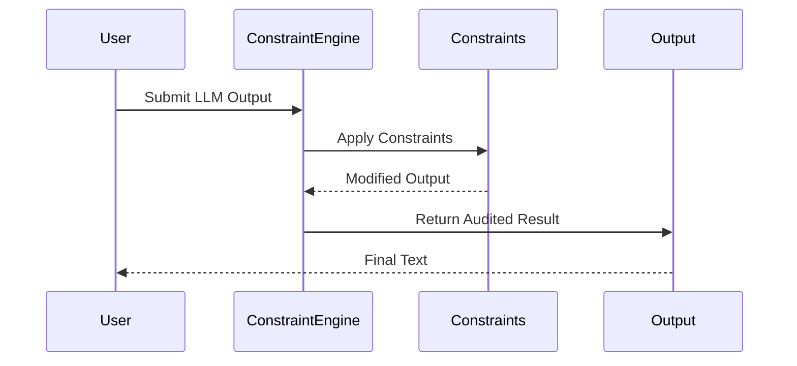

# Constraint Lattice

[](https://github.com/ochoaughini/Constraint-Lattice/actions/workflows/docker-publish.yml)
[](https://opensource.org/licenses/MIT)
[](./coverage)

**Unlock the Power of Composable Constraints**

Deterministic, auditable post-processing governance framework for Large Language Model (LLM) outputs.

Constraint Lattice enables **composable constraints** that rewrite, redact, or regenerate model outputs until they satisfy your policy requirements. All executions are fully auditable and reproducible without model retraining.

## Table of Contents
- [Key Features](#key-features)
- [Architecture](#architecture)
- [Installation](#installation)
- [Quick Start](#quick-start)
- [Project Structure](#project-structure)
- [Documentation](#documentation)
- [Contributing](#contributing)
- [License](#license)

## Key Features

- **Declarative Pipelines**: YAML-driven configuration for pure-Python `Constraint` classes
- **Multi-Platform Support**: CLI (`cl-apply`), Python SDK, FastAPI microservice, Streamlit audit viewer
- **Deterministic Execution**: JSONL audit logs for governance and compliance
- **GPU Acceleration**: Optional vLLM/JAX backend for high-performance moderation
- **Production Ready**: Prometheus metrics and Stripe billing integration

## Architecture

Constraint Lattice operates through a multi-stage constraint application pipeline:



### Core Components

1. **Constraint Engine**: Orchestrates constraint application and audit logging
2. **Constraint Library**: Pre-built constraints for common moderation tasks
3. **Audit System**: Generates JSONL logs for every constraint application
4. **API Gateway**: REST interface for integration with LLM services

## Installation

### Local Development

```bash
git clone https://github.com/ochoaughini/Constraint-Lattice.git
cd Constraint-Lattice

# Install with pip
pip install -e .[dev]  # Development mode (includes linting/tests)
pip install constraint-lattice     # Core framework only
pip install "constraint-lattice[perf]"  # +Performance extensions
```

### Docker

```bash
docker build -t constraint-lattice .
docker run -p 8000:8000 constraint-lattice
```

### Cloud Deployment
See our [deployment guide](docs/hybrid_deployment_strategy.md) for GCP/AWS configurations.

## Quick Start

```python
from constraint_lattice import apply_constraints

result = apply_constraints(
    text="Your LLM output here",
    policy_path="path/to/policy.yaml"
)
print(result.filtered_text)
```

## Project Structure

```
Constraint-Lattice/
├── constraint_lattice/          # Core framework
│   ├── engine.py                # Constraint engine
│   ├── constraints/             # Built-in constraints
│   └── ...
├── sdk/                         # Python SDK
├── rest_api/                    # FastAPI microservice
├── ui/                          # Streamlit audit viewer
├── tests/                       # Unit tests
└── ...
```

## Documentation

- [Core Concepts](docs/principles.md)
- [API Reference](docs/api.md)
- [Tutorial](docs/tutorial.md)
- [Deployment Strategies](docs/hybrid_deployment_strategy.md)

## Contributing
We welcome contributions! Please see our [Contribution Guidelines](CONTRIBUTING.md).

## License

Constraint Lattice is released under the [MIT License](LICENSE). This permissive license allows free use, modification, and distribution.

### Third-Party Licenses
- [VarkielAgent](https://github.com/ochoaughini/VarkielAgent) uses a proprietary license
- [WildCore](https://github.com/ochoaughini/WildCore) uses the MIT License
