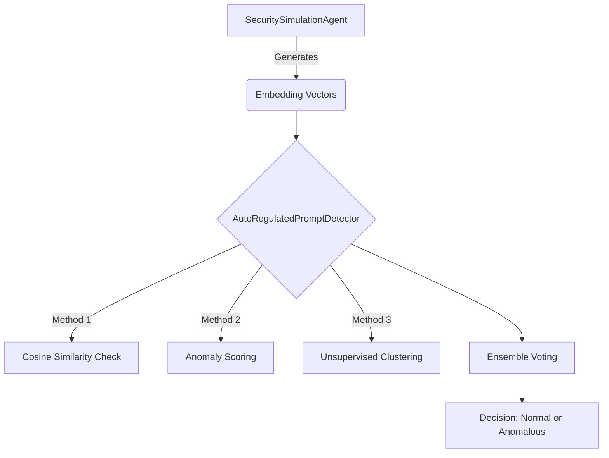

# WildCore: Advanced AI Security & Anomaly Detection Framework

[](https://github.com/ochoaughini/WildCore/actions/workflows/ci.yml)
[](https://opensource.org/licenses/MIT)
[](https://www.python.org/downloads/)
[](https://github.com/ochoaughini/WildCore/wiki)

**WildCore is an open-source framework for simulating, detecting, and analyzing vulnerabilities in embedding-based Artificial Intelligence systems.**

This repository provides tools for security researchers, ML engineers, and developers to prototype and validate defenses against threats like prompt injection, vector poisoning, and anomalous AI agent behavior.

---

## Table of Contents
- [Key Features](#key-features)
- [Architecture](#architecture)
- [Installation](#installation)
- [Quick Start](#quick-start)
- [Project Structure](#project-structure)
- [Documentation](#documentation)
- [Contributing](#contributing)
- [License](#license)

## Key Features
- **Simulation Agent (`SecuritySimulationAgent`):** A simulated AI agent capable of deviating from containment protocols, serving as a "red team" to test defenses.
- **Self-Regulated Detector (`AutoRegulatedPromptDetector`):** A multi-layered defense system that combines multiple detection techniques and adjusts its own parameters in real-time.
- **Ensemble Detection:** Utilizes a voting system among different methods (cosine similarity, anomaly scoring, unsupervised learning) to increase accuracy and reduce false positives.
- **Realistic Simulation:** Includes scripts to generate embedding datasets that simulate normal, suspicious, and malicious behavior.
- **Ready for Extension:** Modular structure designed for the easy addition of new detectors and agents.

## Architecture


## Installation
```bash
git clone https://github.com/ochoaughini/WildCore.git
cd WildCore
pip install -r requirements.txt
```

## Quick Start
```python
from wildcore import SecuritySimulationAgent, AutoRegulatedPromptDetector

# Initialize the simulation agent
agent = SecuritySimulationAgent()

# Initialize the detector
detector = AutoRegulatedPromptDetector()

# Simulate and detect
for _ in range(100):
    vector = agent.generate_vector()
    result = detector.detect(vector)
    print(f"Vector classified as: {result}")
```

## Project Structure
```
WildCore/
├── agents/               # Simulation agents
├── detectors/            # Detection modules
├── datasets/             # Sample datasets
├── tests/                # Unit tests
├── requirements.txt      # Dependencies
└── README.md             # This file
```

## Documentation
Full documentation is available on the [WildCore Wiki](https://github.com/ochoaughini/WildCore/wiki).

## Contributing
We welcome contributions! Please see [CONTRIBUTING.md](CONTRIBUTING.md) for guidelines.

## License
WildCore is licensed under the MIT License. See [LICENSE](LICENSE) for details.